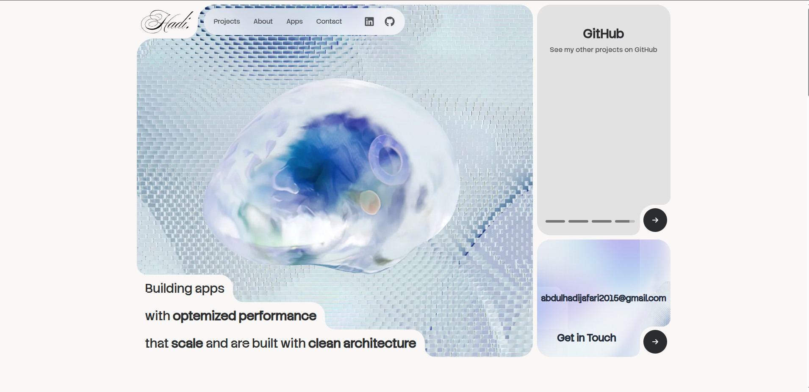

# Hadi Jafari — Portfolio

My personal portfolio showcasing my projects, skills, and experience.

🔗 **Live site:** [hadijafari.dev](https://hadijafari.dev)

## Preview



## Highlights

- ⚡ **Performance-focused** — optimized images with `next/image`, React Compiler enabled, and Vercel Analytics + Speed Insights
- 🎨 **Art-directed hero** — layered animated headline, SVG corner accents, and an auto-advancing project slider
- 📱 **Fully responsive** across devices, from phone to desktop, with a full-screen mobile menu
- 🔍 **SEO & Open Graph optimized** — custom social preview card, JSON-LD person schema, `sitemap.xml`, and `robots.txt`
- ♿ **Accessible** — skip-to-content link, semantic landmarks, labeled icon links, and keyboard-friendly accordions

## Built With

- [Next.js](https://nextjs.org) (App Router) — React framework
- [TypeScript](https://www.typescriptlang.org)
- [Tailwind CSS](https://tailwindcss.com) v4 — styling
- [framer-motion](https://www.framer.com/motion/) — animations
- [Swiper](https://swiperjs.com) — project slider
- Deployed on [Vercel](https://vercel.com)

## Getting Started

```bash
git clone https://github.com/Hadi111jafari/personal-website.git
cd personal-website
npm install
npm run dev
```

Open [http://localhost:3000](http://localhost:3000) to view it locally.

Other scripts: `npm run build` (production build), `npm run start` (serve the build), `npm run lint`, `npm run format` (Prettier).

## Contact

- Email: [abdulhadijafari2015@gmail.com](mailto:abdulhadijafari2015@gmail.com)
- LinkedIn: [abdul-hadi-jafari](https://linkedin.com/in/abdul-hadi-jafari)
- GitHub: [Hadi111jafari](https://github.com/Hadi111jafari)
- Schedule a call: [Calendly](https://calendly.com/abdulhadi111/30min)
